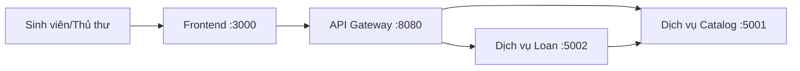

# Hệ Thống Yêu Cầu Mượn Sách Thư Viện

Đây là dự án bài tập microservices tự động hóa quy trình mượn sách đơn giản.
Người dùng có thể xem danh mục sách và tạo yêu cầu mượn qua frontend và gateway.

## Thành Viên Nhóm

| Họ và tên | Mã sinh viên | Vai trò | Đóng góp |
|-----------|--------------|---------|----------|
| Lương Nhật Minh | B22DCVT340 | Lập trình viên full-stack | Phân tích, thiết kế kiến trúc, triển khai API, định tuyến gateway, xây dựng module frontend |

## Quy Trình Nghiệp Vụ

- Miền nghiệp vụ: Vận hành thư viện
- Tác nhân: Sinh viên mượn sách, thủ thư
- Phạm vi: Xem danh mục sách, giữ chỗ tồn kho, tạo và xem danh sách yêu cầu mượn

## Module Demo Đơn Giản

Tên module: Quick Loan Request

- Mục tiêu: Tạo một yêu cầu mượn sách với luồng dễ hiểu nhất để trình bày
- Luồng xử lý: Form frontend -> Gateway proxy -> Service B tạo loan -> Service A trừ tồn kho
- Lý do chọn module: Phạm vi nhỏ, đường đi dữ liệu rõ ràng, dễ demo

## Kiến Trúc



| Thành phần | Trách nhiệm | Công nghệ | Cổng |
|------------|-------------|-----------|------|
| Frontend | Giao diện dashboard cho sách và yêu cầu mượn | HTML, CSS, JavaScript, Nginx | 3000 |
| Gateway | Điểm vào duy nhất, proxy và tổng hợp dữ liệu dashboard | Node.js, Express | 8080 |
| Service A | Quản lý danh mục sách và giữ chỗ tồn kho | Node.js, Express | 5001 |
| Service B | Quản lý yêu cầu mượn sách | Node.js, Express | 5002 |

Tài liệu chi tiết: [docs/analysis-and-design.md](docs/analysis-and-design.md), [docs/architecture.md](docs/architecture.md)

## Getting Started

```bash
# Project has already been initialized with scripts/init.sh
docker compose up --build
```

## Verify Quick Start

```bash
curl http://localhost:8080
curl http://localhost:8080/health
curl http://localhost:5001/health
curl http://localhost:5002/health
curl http://localhost:3000
```

Business endpoint checks:

```bash
curl http://localhost:8080/api/service-a/books
curl -X POST http://localhost:8080/api/service-b/loans \
    -H "Content-Type: application/json" \
    -d '{"bookId":"b1","borrower":"Nguyen Van A"}'
curl http://localhost:8080/api/dashboard
```

## API Documentation

- [Service A OpenAPI](docs/api-specs/service-a.yaml)
- [Service B OpenAPI](docs/api-specs/service-b.yaml)

## License

This project is licensed under [MIT](LICENSE).

