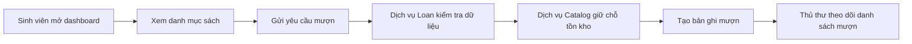
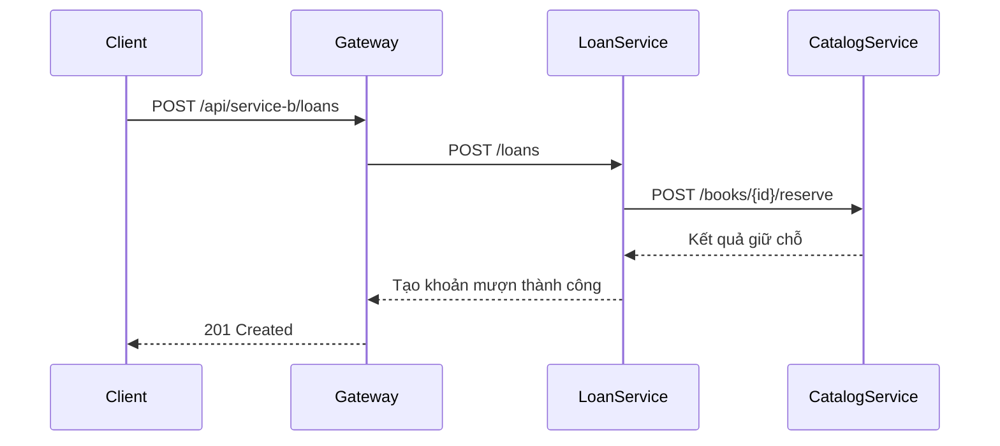
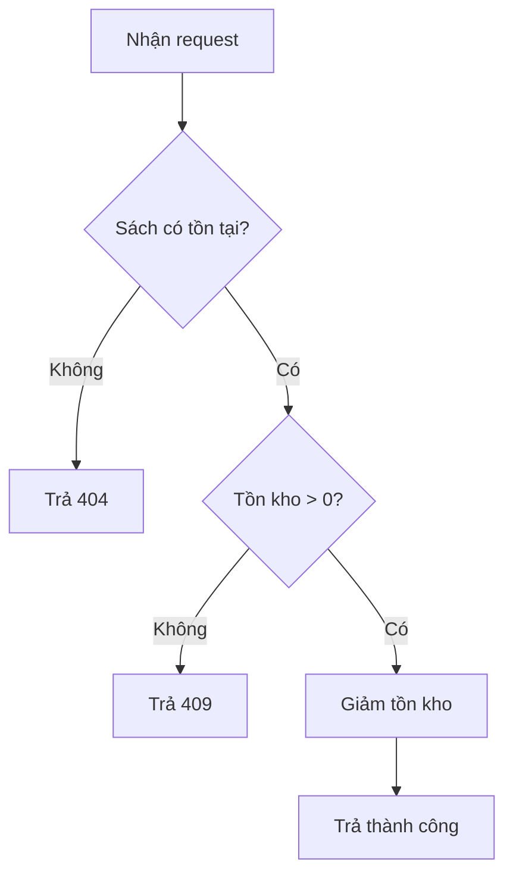
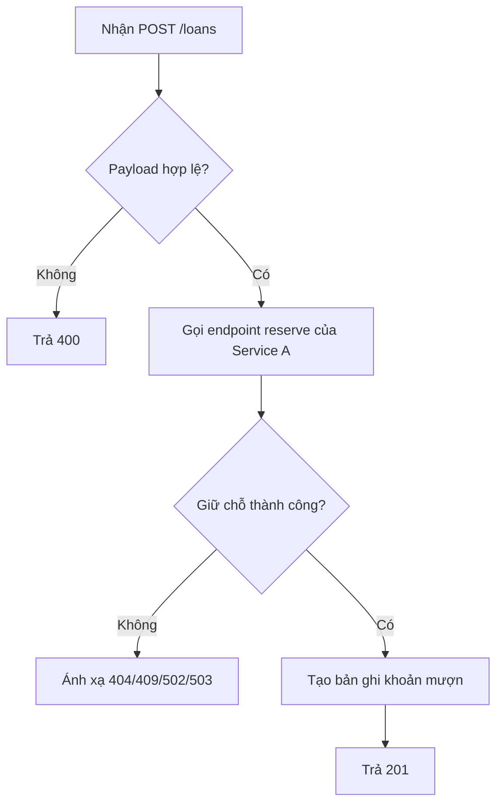

# Phân Tích Và Thiết Kế - Tự Động Hóa Yêu Cầu Mượn Sách Thư Viện

## Phần 1 - Chuẩn Bị Phân Tích

### 1.1 Định Nghĩa Quy Trình Nghiệp Vụ

- Miền nghiệp vụ: Vận hành thư viện
- Quy trình nghiệp vụ: Mượn sách và theo dõi yêu cầu mượn
- Tác nhân: Sinh viên mượn sách, thủ thư
- Phạm vi: Xem danh mục sách, giữ chỗ tồn kho, tạo phiếu mượn, theo dõi các khoản mượn đang hoạt động

Luồng quy trình:

### 1.2 Các Hệ Thống Tự Động Hóa Hiện Có

Không có - quy trình hiện được mô phỏng phục vụ học tập và triển khai từ starter template này.

### 1.3 Yêu Cầu Phi Chức Năng

| Yêu cầu | Mô tả |
|---------|-------|
| Hiệu năng | Mục tiêu thời gian phản hồi API dưới 300ms với xử lý in-memory |
| Bảo mật | Giới hạn điểm vào công khai tại gateway; các service nội bộ chỉ truy cập qua mạng compose |
| Khả năng mở rộng | Các service Node.js không lưu trạng thái, có thể scale ngang |
| Tính sẵn sàng | Mỗi service cung cấp GET /health để kiểm tra sống |

## Phần 2 - Mô Hình Hóa REST/Microservices

### 2.1 Phân Rã Quy Trình Nghiệp Vụ Và 2.2 Lọc Hành Động Không Phù Hợp

| # | Hành động | Tác nhân | Mô tả | Phù hợp? |
|---|-----------|----------|-------|----------|
| 1 | Mở dashboard | Sinh viên/Thủ thư | Truy cập giao diện frontend | Có |
| 2 | Lấy danh mục sách | Hệ thống | Gateway gọi Service A để lấy danh sách sách | Có |
| 3 | Nhập thông tin người mượn | Sinh viên | Dữ liệu nhập thủ công bởi người dùng | Không |
| 4 | Kiểm tra yêu cầu | Service B | Đảm bảo có bookId và borrower | Có |
| 5 | Giữ chỗ tồn kho | Service A | Giảm tồn kho đi một đơn vị | Có |
| 6 | Tạo bản ghi mượn | Service B | Lưu bản ghi khoản mượn (in-memory cho demo) | Có |
| 7 | Rà soát danh sách | Thủ thư | Cần quyết định nghiệp vụ của con người | Không |

### 2.3 Ứng Viên Entity Service

| Thực thể | Ứng viên service | Hành động dùng lại |
|----------|------------------|--------------------|
| Book | Catalog Service (Service A) | Liệt kê sách, lấy chi tiết sách, giữ chỗ tồn kho |
| Loan | Loan Service (Service B) | Tạo khoản mượn, liệt kê khoản mượn |

### 2.4 Ứng Viên Task Service

| Hành động không bất biến | Ứng viên task service |
|---------------------------|------------------------|
| Điều phối truy cập frontend và tổng hợp dữ liệu | API Gateway |

### 2.5 Xác Định Resource

| Thực thể / Quy trình | URI resource |
|----------------------|--------------|
| Health service | /health |
| Tập hợp sách | /books |
| Một cuốn sách | /books/{id} |
| Giữ chỗ sách | /books/{id}/reserve |
| Tập hợp khoản mượn | /loans |
| Tổng hợp dashboard | /api/dashboard |

### 2.6 Ánh Xạ Năng Lực Với Resource Và Phương Thức

| Ứng viên service | Năng lực | Resource | HTTP Method |
|------------------|----------|----------|-------------|
| Service A | Kiểm tra health | /health | GET |
| Service A | Liệt kê sách | /books | GET |
| Service A | Lấy chi tiết sách | /books/{id} | GET |
| Service A | Giữ chỗ tồn kho | /books/{id}/reserve | POST |
| Service B | Kiểm tra health | /health | GET |
| Service B | Liệt kê khoản mượn | /loans | GET |
| Service B | Tạo khoản mượn | /loans | POST |
| Gateway | Tổng hợp dashboard | /api/dashboard | GET |

### 2.7 Ứng Viên Utility Service Và Microservice

| Ứng viên | Loại | Lý do |
|----------|------|-------|
| API Gateway | Utility | Tập trung routing, CORS và logic tổng hợp |
| Catalog service | Microservice | Sở hữu thực thể sách và trạng thái tồn kho |
| Loan service | Microservice | Sở hữu thực thể khoản mượn và workflow mượn |

### 2.8 Ứng Viên Service Composition

## Phần 3 - Thiết Kế Hướng Dịch Vụ

### 3.1 Thiết Kế Hợp Đồng Đồng Nhất

Đặc tả OpenAPI:

- docs/api-specs/service-a.yaml
- docs/api-specs/service-b.yaml

Tóm tắt hợp đồng Service A:

| Endpoint | Method | Media Type | Mã phản hồi |
|----------|--------|------------|-------------|
| /health | GET | application/json | 200 |
| /books | GET | application/json | 200 |
| /books/{id} | GET | application/json | 200, 404 |
| /books/{id}/reserve | POST | application/json | 200, 404, 409 |

Tóm tắt hợp đồng Service B:

| Endpoint | Method | Media Type | Mã phản hồi |
|----------|--------|------------|-------------|
| /health | GET | application/json | 200 |
| /loans | GET | application/json | 200 |
| /loans | POST | application/json | 201, 400, 404, 409, 502, 503 |

### 3.2 Thiết Kế Logic Dịch Vụ

Logic Service A:

Logic Service B:

