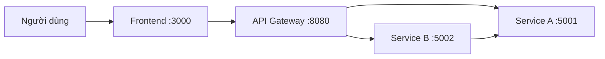

# Kiến Trúc Hệ Thống

> Tài liệu này được hoàn thiện **sau** khi hoàn thành [Phân tích và thiết kế](analysis-and-design.md).
> Dựa trên các Service Candidate và yêu cầu phi chức năng đã xác định, lựa chọn mẫu kiến trúc phù hợp và thiết kế kiến trúc triển khai.

**Tài liệu tham khảo:**
1. *Service-Oriented Architecture: Analysis and Design for Services and Microservices* — Thomas Erl (2nd Edition)
2. *Microservices Patterns: With Examples in Java* — Chris Richardson
3. *Bài tập — Phát triển phần mềm hướng dịch vụ* — Hung Dang

---

## 1. Lựa Chọn Mẫu Kiến Trúc

Lựa chọn các mẫu dựa trên cơ sở nghiệp vụ/kỹ thuật từ phần phân tích.

| Mẫu kiến trúc | Chọn? | Lý do nghiệp vụ/kỹ thuật |
|---------------|-------|--------------------------|
| API Gateway | Có | Frontend dùng một điểm vào duy nhất và gateway tập trung xử lý routing/CORS |
| Database per Service | Không (demo dùng in-memory) | Mô hình này phù hợp production hơn nhưng chưa bắt buộc trong phạm vi bài tập |
| Shared Database | Không | Các service được tách rời bằng hợp đồng API |
| Saga | Không | Luồng ngắn, giữ chỗ theo một bước và phản hồi ngay |
| Event-driven / Message Queue | Không | Request-response đồng bộ là đủ cho tải hiện tại |
| CQRS | Không | Độ phức tạp đọc/ghi thấp |
| Circuit Breaker | Dự kiến bổ sung sau | Có thể tăng khả năng chịu lỗi khi gọi liên service |
| Service Registry / Discovery | Không | Docker Compose DNS (`service-a`, `service-b`) là đủ |
| Khác: Triển khai container hóa | Có | Toàn bộ thành phần chạy bằng Docker Compose |

> Tham khảo: *Microservices Patterns* — Chris Richardson, các chương về decomposition, data management và communication patterns.

---

## 2. Thành Phần Hệ Thống

| Thành phần | Trách nhiệm | Công nghệ | Cổng |
|------------|-------------|-----------|------|
| **Frontend** | Dashboard hiển thị sách và khoản mượn | HTML/CSS/JavaScript + Nginx | 3000 |
| **Gateway** | Điểm vào API, proxy, tổng hợp dữ liệu | Node.js + Express | 8080 |
| **Service A** | Quản lý danh mục và giữ chỗ tồn kho | Node.js + Express | 5001 |
| **Service B** | Tạo và liệt kê khoản mượn | Node.js + Express | 5002 |
| **Database** | Không dùng trong MVP này (dữ liệu in-memory) | N/A | N/A |

---

## 3. Giao Tiếp

### Ma Trận Giao Tiếp Giữa Các Service

| Từ → Đến | Service A | Service B | Gateway | Database |
|----------|-----------|-----------|---------|----------|
| **Frontend** | Không gọi trực tiếp | Không gọi trực tiếp | HTTP GET /api/dashboard và các route proxy | Không |
| **Gateway** | HTTP proxy và fetch | HTTP proxy và fetch | Tự xử lý | Không |
| **Service A** | Tự xử lý | Không gọi trực tiếp | Chỉ trả response | Không |
| **Service B** | HTTP call để giữ chỗ sách | Tự xử lý | Chỉ trả response | Không |

---

## 4. Sơ Đồ Kiến Trúc

> Lưu sơ đồ trong `docs/asset/` và tham chiếu tại đây.

---

## 5. Triển Khai

- Tất cả service được container hóa bằng Docker
- Điều phối bằng Docker Compose
- Chạy toàn hệ thống bằng một lệnh: `docker compose up --build`
- Giao tiếp nội bộ dùng DNS service của Docker (không dùng localhost)
