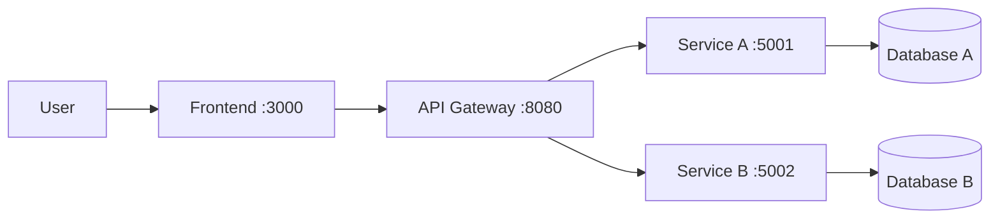

<<<<<<< HEAD
# Project Name

[](https://github.com/hungdn1701/microservices-assignment-starter/stargazers)
[](https://github.com/hungdn1701/microservices-assignment-starter/network/members)
[](LICENSE)

> Brief description of the business process being automated and the service-oriented solution.

> **New to this repo?** See [`GETTING_STARTED.md`](GETTING_STARTED.md) for setup instructions and workflow guide.

---

## Team Members

| Name | Student ID | Role | Contribution |
|------|------------|------|-------------|
|      |            |      |             |

---

## Business Process

*(Summarize the business process being automated — domain, actors, scope)*

---

## Architecture



| Component     | Responsibility | Tech Stack | Port |
|---------------|----------------|------------|------|
| **Frontend**  |                |            | 3000 |
| **Gateway**   |                |            | 8080 |
| **Service A** |                |            | 5001 |
| **Service B** |                |            | 5002 |

> Full documentation: [`docs/architecture.md`](docs/architecture.md) · [`docs/analysis-and-design.md`](docs/analysis-and-design.md)

---

## Getting Started

```bash
# Clone and initialize
git clone <your-repo-url>
cd <project-folder>
cp .env.example .env

# Build and run
docker compose up --build
```

### Verify

```bash
curl http://localhost:8080/health   # Gateway
curl http://localhost:5001/health   # Service A
curl http://localhost:5002/health   # Service B
```

---

## API Documentation

- [Service A — OpenAPI Spec](docs/api-specs/service-a.yaml)
- [Service B — OpenAPI Spec](docs/api-specs/service-b.yaml)

---

## License

This project uses the [MIT License](LICENSE).

> Template by [Hung Dang](https://github.com/hungdn1701) · [Template guide](GETTING_STARTED.md)

=======
"# e03-mid-project-340" 
# e03-mid-project-340
>>>>>>> 6c76a2f73af6769ea7dc04f39ce434567b318578
